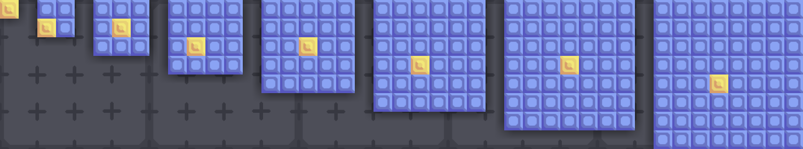
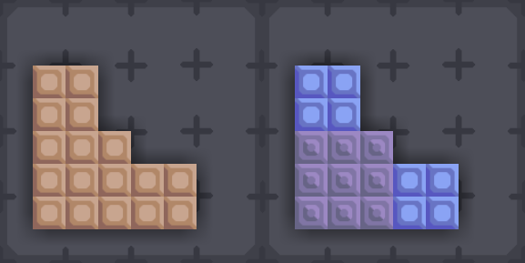
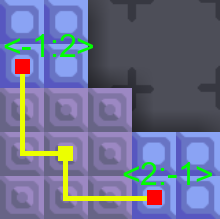

# Multi-Block Library
A Java Mindustry mod library which provides support for non-square blocks implementation for json mod.
***
## Guide
Currently, this mod provided Multi-Block version of `GenericCrafter`: `MultiBlockCrafter`.
it provided a new Integer array field: `linkValues` that used to control the shape of the crafter.
also, this mod provided several new drawer to adapt the Multi-Block.

[1] First you need to know the center tile of a block:

* For odd size block, the center tile is right its center.
* For even size block, the center tile is the bottom right tile among the center 4 tiles.
* You can check the center tile (surge wall) for blocks form size 1 to 8 in the below image.



[2] Figure the shape of the block you want.
* In this step, you can just simply consider the Multi-Block structure as container/vault attached to core.
  You can simply place some blocks in game and get the shape you want and then divide the shape with several rects.
* The example is below. The left copper wall struct are wanted shape, the right are divided rects 
  (two 2x2 titanium wall rect & one 3*3 thorium shape). Choose one rect as the `CenterEntity`(in this case the thorium is the best choice). 
  The other rects are considered as `LinkEntity` to the center rect.


* Calculate the `linkValues`. As mentioned above, find each `LinkEntity`'s center tile, and get the relative position
  to the `CenterEntity`'s center tile. in this example they are <-1, 2> and <2, -1>. Append the `LinkEntity`'s size after
  the position: [-1, 2, 2] & [2, -1, 2]. combine them and get the final `linkValues`: [-1, 2, 2, 2, -1, 2] (Notice: In no particular order)



[3] Prepare for the sprites
* Notice: due to shading issues, you need to draw 4 sprites with 4 different rotation.
  You can check the example sprite here: [Sprite Rotation](./template/sprites/blocks/rotSprite).
* Some vanilla drawers doesn't support sprites with rotation. Several drawers are provided:
  [DrawFlameRotated](./src/multiblock/extend/DrawFlameRotated.java),
  [DrawLiquidRegionRotated](./src/multiblock/extend/DrawLiquidRegionRotated.java),
  [DrawRegionRotated](./src/multiblock/extend/DrawRegionRotated.java)

[4] Write the JSON file
```JSON
{
  "type": "MultiBlockCrafter",
  "name": "example",
  "linkValues": [2, -1, 2, -1, 2, 2],
  "size": 3,
  "hasPower": true,
  "hasLiquids": true,
  "hasItems": true,
  "outputItem": { "item": "lead", "amount": 2},
  "outputLiquid": {"liquid": "water", "amount": 0.2},
  "consumes": {
    "power":1,
    "items": {
      "items": [
        { "item": "titanium", "amount": 1},
        { "item": "silicon", "amount": 2}
      ]
    },
    "liquids": [
      {"liquid": "cryofluid","amount":0.2}
    ]
  },
  "drawer": {
    "type": "DrawMulti",
    "drawers": [
      {
        "type": "DrawRegionRotated",
        "suffix": "-bottom",
        "oneSprite": true
      },
      {
        "type": "DrawLiquidRegionRotated",
        "suffix": "-liquid-water",
        "drawLiquid": "water"
      },
      {
        "type": "DrawLiquidRegionRotated",
        "suffix": "-liquid-cryofluid",
        "drawLiquid": "cryofluid"
      },
      {
        "type": "DrawRegionRotated",
        "suffix": "-rot"
      },
      {
        "type": "DrawFlameRotated",
        "x": 0,
        "y": 0
      }
    ]
  },
  "requirements": [
    { "item": "copper", "amount": 30 }
  ],
  "category": "crafting"
}
```
That's it, load the JSON in your mod and it should work properly.

---
Hope this library can help your json modding a lot.
If you find this library helping, consider star this repo? >_<
